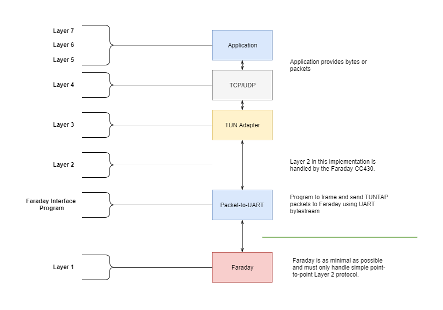

# TUNTAP Network interfaces

A TUN interface provides a software method to simulate a network interface card at the layer 3 level. Primarily used to encrypt or tunnel data prior to physically leaving a computer it is useful to FaradayRF because it creates a standard network interface where a stream of bytes/packets are both inputted and outputted. Standard tools, protocols, and programs can be used during development such as Wireshark, TCP/UDP, and FTP without creating awkward custom interfaces.

## Development Plan Milestones

This project is will general follow the following high level milestones. All implementations assume a Linux host computer connected to Faraday.

* Implement simple peer-to-peer communication between two Faraday units (NETCAT data)
* Send UDP frames between two Faraday units
* Establish TCP connection between two Faraday units
* Transfer file(s) between two Faraday units (FTP)
* Additional milestones tbd...

## Hardware Interfaces
The diagram below shows a high level hardware interface for the TUNTAP implementation. TUNTAP is used as a standard application interface and for protocols such as TCP/UDP. If possible utilizing the adapter to perform Layer 2 functionality and truly removing most of the firmware functionality should be explored.

## Network Layer Overview

This diagram details the layer stack and protocol/program/adapter that creates the respective layer.

The goal is to provide as much standard interfaces and protocols as possible and minimize custom programs and protocols. Faraday simply provides a packet in / packet out functionality and lets the higher level software and computer do the heavy protocol lifting. Faraday will need to implement a Layer 2 protocol to communicate between hardware units over RF.

### Layers 5-7 - Application Layer

The application layer provides functionality to the network medium create by Faraday. This will generally comprise of standard programs such as FTP and others but also utilize custom programs. This is where amateur radio specific applications and likely including  future plans for delay tolerant network functionality.

### Layer 4 - Transport Layer

Use of standard TCP/UDP sockets will be assumed.

### Layer 3 - Network Layer

A TUN network adapter provides the virtual Layer 3 interface. The networking layer as of current is only used as a convenient interface mechanism and all units will use a predetermined IP addressing scheme. Actual TX/RX unit identification and communication is  controlled at the datalink layer.

### Layer 2 - Datalink Layer

The datalink layer will utilize a simplistic packet framing protocol that allows communication between multiple Faraday units. Given the wireless medium could have more that two units within range a simple MAC (medium access control) method needs to be implemented. The simplest approach is to address and filter based on CALLSIGN and NODE-ID.

The MAC implements CSMA (Carrier Sense Multiple Access) use CC430 hardware support. Future implementations could support TDMA (Time Division Multiple Access) or FHSS (Frequency Hop Spread Spectrum).

### Layer 1 - Transport Layer

The physical layer is created using the CC430 hardware set to GMSK configuration.

## Program Modules

Program modules needed to create this network interface are organized within their own repositories.

* **High Level Service Program**
   * A top level program that executes and coordinates all the needed modules to implement network services over Faraday units.
* **TUN Network Adapter**
  * Provides a virtual network adapter used to communicate with Faraday. Data is communicated using packets of Layer 3 format.
* **TUN-to-UART**
  * Links TUN network adapter to Faraday by moving packets of data between Faraday (UART) and the TUN adapter.
  * A standard framing protocol is needed. Use a standard like SLIP (byte framing).
* **Unit Configuration**
  * A program that provides functionality to update memory configuration and device settings on Faraday.
  * Functionality to query and read current configuration and settings should also be provided.
  * Likely this can be implemented using a tie-in over the Datalink layer or framing protocol. Alternatively these settings could be left to update only by data frames provided within the first seconds of boot.

# Implementation Questions

* Do we need a TAP interface or can we skip it?
  * TAP interface is NOT needed and not useful per current understanding. It is best to implement a Layer 2 (datalink) either on Faraday hardware or in python.
* Can Faraday communicate between two units with only a byte buffer and relying on higher level programs to control flow of data?
  * A layer 2 is needed and Faraday would be responsible for fragmenting and reassembling packets from the Layer 3 TUN network adapter.
* How could we plan for Faraday to implement (Layer 2?) functionality in the future that allows TDMA(time division multiple access) or FHSS (frequency hop spread spectrum) using the CC1101 features?
  * Layer 2 needs to be implemented on Faraday or in python (weird, keep on Faraday for now). We need to create a mechanism/method for updating device settings.
